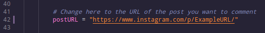
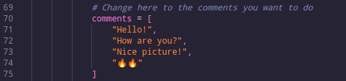

# Insta BOT :robot:

Um bot feito com o simples intuito de comentar em fotos (por enquanto so comenta em uma) no Instagram.

E feito também para fins de aprendizado de automação usando Python3 e Selenium.

## Requisitos

- [Mozilla Firefox](https://www.mozilla.org/pt-BR/firefox/new/)
- [Geckodriver](https://github.com/mozilla/geckodriver/releases) (baixe a versao mais recente, extraia e coloque no path)
- [Python3](https://www.python.org/)

```
sudo apt install python3
```

- [Selenium](https://www.selenium.dev/)

```
pip3 install selenium
```

Por último, mas não menos importante, precisamos clonar o repositório:

```
git clone https://github.com/ribeiro-dev/insta_bot.git
```


## Como usar

Primeiro, você precisa alterar o código para dizer qual o post irá comentar.

Use um editor de texto qualquer e modifique a URL exemplo do arquivo `main.py` na parte indicada abaixo:




Depois, ainda no editor de texto, você altera os comentários padrões para os que você quer




Após isso, com o terminal no diretório do projeto, você vai rodar o comando:

```
python main.py
```

O programa irá rodar e vai pedir seu login e depois a senha. A partir daí, é só você preencher, pressionar enter e aguardar a mágica ser feita! 


# Créditos

Eu não estava conseguindo inserir os comentários no campo de texto do instagram e acabei deixando o projeto um pouco de lado. Mas depois de muito tempo, o Youtube me recomendou um vídeo do canal [DevAprender](https://www.youtube.com/channel/UCm63tB8wsKOVvxoU4iMpS2A), que ensinava a criar um bot que comentava em fotos do Instagram.

E a partir desse vídeo, eu consegui a solução pro meu problema. Então eu deixo aqui um agradecimento ao Jhonatan, do canal [DevAprender](https://www.youtube.com/channel/UCm63tB8wsKOVvxoU4iMpS2A), que me ajudou a finalizar esse projeto.

- Link do vídeo para quem tiver interesse: https://youtu.be/nb_gbWzGpPM